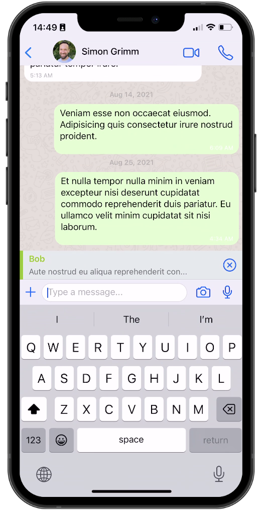

# React Native WhatsApp Clone with Clerk

This project is a WhatsApp clone developed using React Native. It incorporates [Clerk](https://clerk.com/?utm_source=sponsorship&utm_medium=github&utm_campaign=simong&utm_content=rn-whatsapp) for seamless user authentication via OTP (One-Time Password).

### Additional Features:

- **[Expo Router](https://docs.expo.dev/routing/introduction/):** Utilizes Expo Router for file-based navigation, ensuring smooth navigation throughout the app.
- **[SMS OTP Authentication](https://clerk.com/docs/custom-flows/email-sms-otp?utm_source=sponsorship&utm_medium=github&utm_campaign=simong&utm_content=rn-whatsapp):** Integrated SMS OTP authentication with Clerk, providing a secure and user-friendly authentication process.
- **[Reanimated 3](https://docs.swmansion.com/react-native-reanimated/):** Employs Reanimated 3 for fluid and captivating animations, enhancing the overall user experience.
- **[Gesture Handler](https://docs.swmansion.com/react-native-gesture-handler/):** Incorporates Gesture Handler for intuitive gesture-based interactions within the app.
- **[Gifted Chat](https://github.com/FaridSafi/react-native-gifted-chat):** Utilizes Gifted Chat for an aesthetically pleasing and feature-rich chat UI, enhancing the messaging experience for users.

## Screenshots

## Demo

